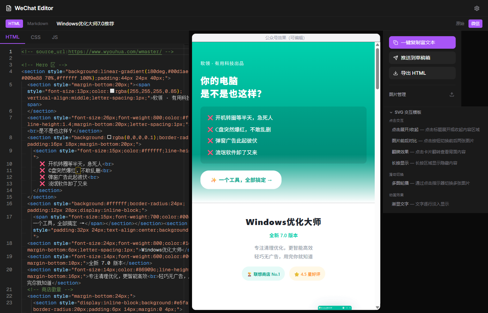
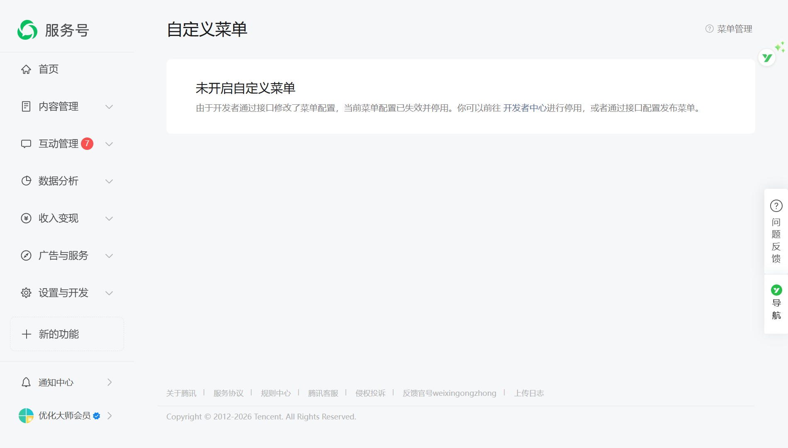

# MBEditor

微信公众号文章编辑器 — 所见即所得编辑、实时预览、一键推送草稿箱。

支持 AI 代理（Claude Code / Codex / OpenClaw）通过 REST API 直接创建和发布文章。



## 功能特性

### 编辑器
- **双模式编辑** — HTML 模式（HTML / CSS / JS 三栏）+ Markdown 模式（多主题渲染）
- **Monaco 代码编辑器** — 语法高亮、自动补全、多 Tab 切换
- **所见即所得预览** — iframe 沙箱渲染，支持 contentEditable 直接编辑
- **原始 / 微信双视图** — 一键切换原始效果和微信公众号排版效果

### 发布
- **一键复制富文本** — 复制处理后的 HTML 到剪贴板，直接粘贴到公众号编辑器
- **一键推送草稿箱** — 自动处理图片上传 + CSS 内联 + 发布到微信草稿箱
- **导出 HTML** — 下载为独立 HTML 文件

### 图片与素材
- **本地图床** — 上传图片自动 MD5 去重，按日期归档
- **微信 CDN 自动上传** — 发布时自动将本地/外链图片上传到微信永久素材
- **格式自动转换** — WebP / SVG / BMP / TIFF 自动转 PNG
- **SVG 交互模板** — 内置点击交互、动画效果、滑动切换等公众号特效模板

### 微信兼容
- **CSS Inline 化** — 通过 premailer 自动将样式内联
- **智能清洗** — 自动过滤微信不支持的 CSS（@keyframes、@media、伪类等）
- **标签转换** — `<div>` → `<section>`，移除不兼容属性
- **自动生成封面** — 未设置封面时自动生成默认封面图

### AI Agent Skill（特色功能）

MBEditor 提供完整的 REST API，可作为 AI 代理的 **Skill / Tool** 使用。AI 可以通过 curl 命令完成从创建文章到发布的全流程：

```bash
# AI 创建文章 → 写入内容 → 推送到草稿箱，全程无需打开浏览器
curl -X POST /api/v1/articles -d '{"title":"AI写的文章","mode":"html"}'
curl -X PUT /api/v1/articles/{id} -d '{"html":"<h1>标题</h1><p>正文</p>"}'
curl -X POST /api/v1/publish/draft -d '{"article_id":"{id}"}'
```

## 截图

<table>
<tr>
<td width="65%"><strong>编辑器界面</strong> — 左侧代码编辑 + 中间实时预览 + 右侧操作面板</td>
<td width="35%"><strong>公众号效果预览</strong></td>
</tr>
<tr>
<td></td>
<td></td>
</tr>
</table>

<details>
<summary><strong>微信公众号后台 — 草稿箱管理</strong></summary>

</details>

## 技术栈

| 层 | 技术 |
|---|------|
| 前端 | React 19 + TypeScript + Tailwind CSS 4 + Vite 6 + Monaco Editor |
| 后端 | FastAPI + Python + premailer + Pillow |
| 部署 | Docker Compose (Nginx + Uvicorn) |

## 快速开始

### 前置要求

- Docker & Docker Compose
- 微信公众号 AppID 和 AppSecret（[微信公众平台](https://mp.weixin.qq.com/)）

### Docker 部署（推荐）

```bash
# 1. 克隆仓库
git clone https://github.com/AAAAAnson/mbeditor.git
cd mbeditor

# 2. 配置微信凭据
cp data/config.json.example data/config.json
# 编辑 data/config.json，填入你的 appid 和 appsecret

# 3. 启动服务
docker compose up -d
```

访问 `http://localhost:7070` 开始使用。

### 本地开发

```bash
# 后端
cd backend
pip install -r requirements.txt
uvicorn app.main:app --reload --port 7071

# 前端（新终端）
cd frontend
npm install
npm run dev
```

前端开发服务器会自动代理 `/api` 和 `/images` 请求到后端。

## 使用 AI 工具部署和操作

MBEditor 天然支持 AI 代理通过 API 操作。以下是各主流 AI 编程工具的使用方法。

### Claude Code

在项目目录下直接使用，Claude Code 会自动识别项目结构：

```bash
# 部署
claude "帮我用 docker compose 部署这个项目，配置好微信凭据"

# 写文章并发布
claude "帮我写一篇关于 AI 的公众号文章，排版精美一些，然后推送到草稿箱"

# 管理
claude "列出所有文章"
claude "把第一篇文章的标题改成新标题"
```

也可以将 `skill/SKILL.md` 安装为 Claude Code Skill，让 Claude 在任何目录下都能操作：

```bash
# 将 skill 文件复制到 Claude Code 用户级 skills 目录
# macOS/Linux:
cp skill/SKILL.md ~/.claude/skills/wechat-editor.md
# 之后在任意目录使用 /wechat-editor 即可触发
```

### Codex (OpenAI)

Codex CLI 可通过项目内的 AGENTS.md 或直接调用 API：

```bash
# 在项目目录下
codex "部署这个微信编辑器项目"
codex "调用 API 创建一篇文章并写入 HTML 内容"

# 直接调用 API（Codex 会读取 README 了解端点）
codex "用 curl 调用 http://localhost:7071/api/v1/articles 创建文章"
```

### OpenClaw

MBEditor 提供 OpenClaw 兼容的 Skill 定义（`skill/SKILL.md`），注册后即可使用：

```bash
# 注册 skill
openclaw skill add ./skill/SKILL.md

# 使用自然语言操作
openclaw "帮我写一篇公众号推文，主题是 Docker 入门"
openclaw "上传 cover.jpg 作为封面，然后发布到草稿箱"
```

### 通用：REST API 直接调用

任何支持 HTTP 请求的 AI 工具都可以通过 API 操作 MBEditor：

```bash
# 创建文章
curl -X POST http://localhost:7071/api/v1/articles \
  -H "Content-Type: application/json" \
  -d '{"title":"我的文章","mode":"html"}'

# 写入内容
curl -X PUT http://localhost:7071/api/v1/articles/{article_id} \
  -H "Content-Type: application/json" \
  -d '{"html":"<h1>标题</h1><p>正文内容</p>","css":"h1{color:#333;}"}'

# 上传图片
curl -X POST http://localhost:7071/api/v1/images/upload \
  -F "file=@image.jpg"

# 推送到微信草稿箱
curl -X POST http://localhost:7071/api/v1/publish/draft \
  -H "Content-Type: application/json" \
  -d '{"article_id":"xxx","author":"作者名","digest":"摘要"}'
```

## API 参考

### 文章管理

| 方法 | 端点 | 说明 |
|------|------|------|
| `POST` | `/api/v1/articles` | 创建文章（`title`, `mode`: html/markdown） |
| `GET` | `/api/v1/articles` | 列出所有文章 |
| `GET` | `/api/v1/articles/{id}` | 获取文章详情 |
| `PUT` | `/api/v1/articles/{id}` | 更新文章（`title`, `html`, `css`, `js`, `markdown`, `cover`, `author`, `digest`） |
| `DELETE` | `/api/v1/articles/{id}` | 删除文章 |

### 图片管理

| 方法 | 端点 | 说明 |
|------|------|------|
| `POST` | `/api/v1/images/upload` | 上传图片（multipart/form-data） |
| `GET` | `/api/v1/images` | 列出所有图片 |
| `DELETE` | `/api/v1/images/{id}` | 删除图片 |

### 发布

| 方法 | 端点 | 说明 |
|------|------|------|
| `GET` | `/api/v1/publish/html/{id}` | 获取处理后的 HTML |
| `POST` | `/api/v1/publish/preview` | 预览处理（CSS 内联，不保存） |
| `POST` | `/api/v1/publish/process` | 处理文章（图片上传到微信 CDN） |
| `POST` | `/api/v1/publish/draft` | 推送到微信草稿箱 |

### 配置

| 方法 | 端点 | 说明 |
|------|------|------|
| `GET` | `/api/v1/config` | 查看配置状态 |
| `PUT` | `/api/v1/config` | 设置 AppID / AppSecret |

## 项目结构

```
mbeditor/
├── frontend/                # React 前端
│   └── src/
│       ├── pages/           # ArticleList / Editor / Settings
│       ├── components/
│       │   ├── editor/      # Monaco 编辑器、Markdown 编辑器
│       │   ├── preview/     # 微信预览 iframe
│       │   └── panel/       # 操作面板、图片管理、SVG 模板
│       ├── hooks/           # useImageUpload, useClipboard
│       └── utils/           # CSS 内联、Markdown 渲染、HTML 提取
├── backend/                 # FastAPI 后端
│   └── app/
│       ├── api/v1/          # REST API 路由
│       ├── services/        # 文章、图片、微信 API 服务
│       └── core/            # 配置、异常、响应格式
├── data/                    # 运行时数据（gitignored）
│   └── config.json.example  # 配置模板
├── skill/                   # AI Agent Skill 定义
│   └── SKILL.md             # OpenClaw / Claude Code 兼容
├── docker-compose.yml       # 一键部署
└── LICENSE
```

## 贡献者

<a href="https://github.com/AAAAAnson">
  
</a>

**[AAAAAnson](https://github.com/AAAAAnson)** — 创建者与维护者

欢迎提交 Issue 和 Pull Request！

## 许可证

[MIT](LICENSE) &copy; 2026 Anson
