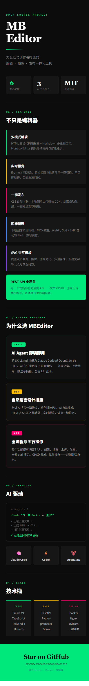
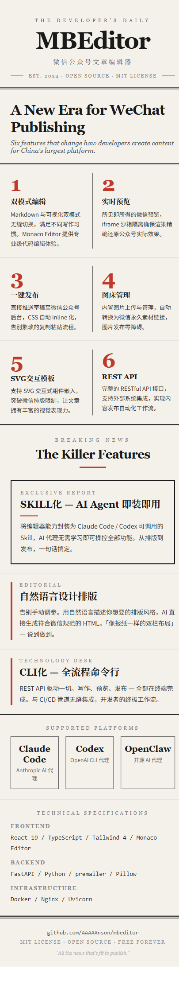
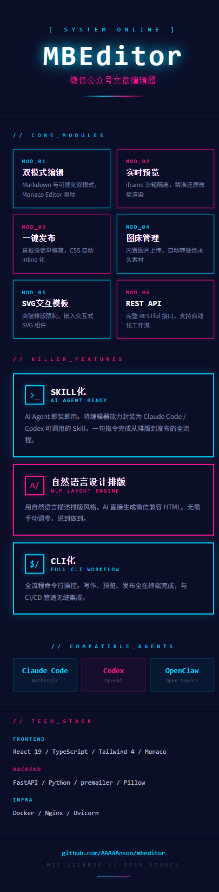
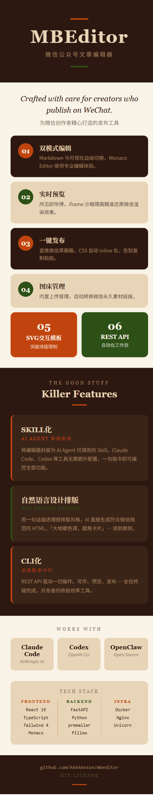
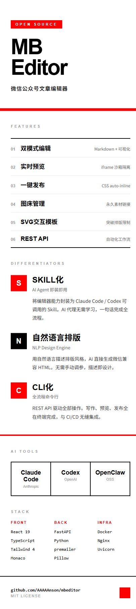

<div align="center">

# MBEditor

### 首款 AI Agent 原生的微信公众号编辑器

**告诉你的 Agent 一句话，从排版到发布全自动完成。**

[](LICENSE)
[](docker-compose.yml)
[](skill/mbeditor.skill.md)
[](https://github.com/AAAAAnson/mbeditor/releases/tag/v3.0)

</div>

---


## 为什么做了这个

市面上的公众号编辑器都是给人用的。

但当 AI Agent 成为内容生产的主力，编辑器需要的不是更好看的 UI，而是 **能被程序调用的接口**。MBEditor 的每个功能都是一个 API 端点——创建文章、上传图片、切换排版、推送草稿箱——全部 `curl` 一行搞定。

你可以用 Claude Code 说一句「写一篇 Docker 入门推文，杂志风排版，发到草稿箱」，剩下的事情 Agent 自己完成。

## 三个核心差异

<table>
<tr>
<td width="33%">

**Agent 原生**

不是"兼容 AI"，是"为 AI 设计"。完整 RESTful API，Skill 文件即装即用。Claude Code / Codex / OpenClaw 任意一个 Agent 都能直接操控编辑器。

</td>
<td width="33%">

**CLI 全流程**

从创建到发布，不需要打开浏览器。所有操作都可以用命令行完成。适合 CI/CD 流水线、定时任务、批量生产。

</td>
<td width="34%">

**高度自定义排版**

三种编辑模式 + 丰富 HTML 排版组件 + 无限自定义。HTML/CSS/JS 三栏编辑给你完全的排版控制权，Markdown 模式让你专注写作。

</td>
</tr>
</table>

## 快速开始

### 第一步：部署 MBEditor

```bash
git clone https://github.com/AAAAAnson/mbeditor.git
cd mbeditor
docker compose up -d
```

部署完成后：
- **编辑器界面**：http://localhost:7073
- **API 接口**：http://localhost:7072/api/v1

**已部署过的用户升级到最新版：**

```bash
cd mbeditor
git pull
docker compose up --build -d
```

> 升级不会丢失数据，文章和图片存储在 `data/` 目录中，不受容器重建影响。

### 第二步：安装 AI Agent Skill

MBEditor 提供了 `skill/mbeditor.skill.md`，安装后 Agent 就能直接操控编辑器。根据你使用的 Agent 选择对应方式：

<details open>
<summary><strong>Claude Code</strong></summary>

**方式一：项目级安装（推荐）**

在 MBEditor 项目目录下直接使用，Agent 会自动发现 `skill/mbeditor.skill.md`：

```bash
cd mbeditor
claude "帮我写一篇关于 Docker 的推文，推到草稿箱"
```

**方式二：全局安装（任意目录可用）**

将 Skill 文件复制到 Claude Code 的全局 skills 目录：

```bash
# macOS / Linux
mkdir -p ~/.claude/skills
cp skill/mbeditor.skill.md ~/.claude/skills/mbeditor.skill.md

# Windows
mkdir %USERPROFILE%\.claude\skills
copy skill\SKILL.md %USERPROFILE%\.claude\skills\mbeditor.skill.md
```

安装后在任意目录都可以使用：

```bash
claude "写一篇 AI 入门的公众号文章，杂志风排版，发到草稿箱"
```

</details>

<details>
<summary><strong>Codex</strong></summary>

将 Skill 文件放到 Codex 的 agents 目录：

```bash
# macOS / Linux
mkdir -p ~/.codex/agents
cp skill/mbeditor.skill.md ~/.codex/agents/mbeditor.skill.md

# 使用
codex "部署微信编辑器，然后写一篇推文发到草稿箱"
```

</details>

<details>
<summary><strong>OpenClaw</strong></summary>

使用 OpenClaw 的 skill 命令直接注册：

```bash
openclaw skill add ./skill/mbeditor.skill.md

# 使用
openclaw "写一篇公众号推文，主题是 Docker 入门"
```

</details>

> **注意**：Skill 中默认端口为 Docker 部署的 `7072`（API）和 `7073`（编辑器）。如果你用本地开发模式运行，需要将端口改为对应的本地端口，或在 `docker-compose.yml` 中修改端口映射。

### 第三步：配置微信公众号（可选）

如果需要一键推送到公众号草稿箱，在编辑器的「设置」页面填入微信公众号的 AppID 和 AppSecret，或通过 API 配置：

```bash
curl -X PUT http://localhost:7072/api/v1/config \
  -H "Content-Type: application/json" \
  -d '{"appid":"wx你的appid","appsecret":"你的appsecret"}'
```

## Agent 工作流

MBEditor 的设计哲学是 **Agent First**。Agent 通过 REST API 完成全部操作：

```bash
# 1. 创建文章
curl -X POST http://localhost:7072/api/v1/articles \
  -H "Content-Type: application/json" \
  -d '{"title":"AI 入门指南","mode":"html"}'
# → {"data": {"id": "a1b2c3"}}

# 2. 写入内容
curl -X PUT http://localhost:7072/api/v1/articles/a1b2c3 \
  -d '{"html":"<h1>AI 入门</h1><p>正文...</p>", "css":"h1{color:#333}"}'

# 3. 上传图片
curl -X POST http://localhost:7072/api/v1/images/upload \
  -F "file=@cover.png"

# 4. 一键推送到微信草稿箱
curl -X POST http://localhost:7072/api/v1/publish/draft \
  -d '{"article_id":"a1b2c3"}'
```

或者一句话搞定：

```bash
claude "写一篇关于 MBEditor 的推文，杂志风排版，推到草稿箱"
```

## 推荐搭配 Skill

MBEditor 负责编辑和发布，排版设计和内容风格可以搭配以下 Skill 使用（仅供参考）：

| Skill | 用途 | 链接 |
|-------|------|------|
| **Anthropic Frontend Design** | 排版设计风格 — 生成高质量、有设计感的 HTML 排版，告别 AI 味 | [anthropics/skills/frontend-design](https://github.com/anthropics/skills/tree/main/skills/frontend-design) |
| **Khazix Skills** | 内容写作风格 — 公众号长文写作，个人风格化的内容输出 | [KKKKhazix/khazix-skills](https://github.com/KKKKhazix/khazix-skills) |

```bash
# 安装示例（Claude Code）
claude install-skill https://github.com/anthropics/skills/tree/main/skills/frontend-design
claude install-skill https://github.com/KKKKhazix/khazix-skills
```

> 搭配使用：让 Khazix Skill 负责内容创作，Frontend Design Skill 负责排版风格，MBEditor 负责预览和发布到公众号。三者配合实现从写作到发布的全链路自动化。

## 编辑器功能


### 三种编辑模式

| 模式 | 适合谁 | 能做什么 |
|------|--------|---------|
| **HTML 模式** | 设计师 / Agent | HTML + CSS + JS 三栏编辑，像素级控制每一个元素 |
| **Markdown 模式** | 写作者 | 用最简洁的语法写作，多种排版主题自动渲染 |
| **可视化编辑** | 所有人 | 所见即所得，在预览区直接编辑内容 |

### HTML 排版组件

内置丰富的纯 inline style 排版组件，复制到公众号后完美还原：

- **标签徽章** — 彩色圆角标签，适合分类标记
- **渐变卡片** — 深色渐变背景 + 亮色文字，适合重点强调
- **数据看板** — 多列数字统计展示
- **时间线** — 带节点的步骤流程图
- **引用样式** — 侧边线引用 + 装饰引号
- **对比表格** — 功能对比矩阵，适合产品介绍

### 发布能力

- 一键复制富文本到剪贴板（所见即所得，预览效果 = 发布效果）
- 一键推送到微信公众号草稿箱
- 自动将本地/外部图片上传到微信 CDN
- 自动生成文章封面图
- CSS 自动内联化 + 基础排版样式注入，标签自动转换为微信兼容格式

## 排版示例

MBEditor + AI 可以用自然语言生成任意风格的排版。

<table>
<tr>
<td align="center" width="33%"><strong>明亮清新</strong></td>
<td align="center" width="33%"><strong>暗黑终端</strong></td>
<td align="center" width="34%"><strong>报纸编辑部</strong></td>
</tr>
<tr>
<td></td>
<td></td>
<td></td>
</tr>
<tr>
<td align="center" width="33%"><strong>霓虹赛博</strong></td>
<td align="center" width="33%"><strong>大地暖色</strong></td>
<td align="center" width="34%"><strong>瑞士极简</strong></td>
</tr>
<tr>
<td></td>
<td></td>
<td></td>
</tr>
</table>

> 所有模板均为纯 inline style + `<section>` 标签，100% 微信兼容。你也可以用自然语言描述任意风格，AI 实时生成。

<details>
<summary><strong>查看生成这些风格的提示词</strong></summary>

**明亮清新**
```
帮我写一篇推文，明亮清新风格。浅色渐变背景，彩色图标卡片，圆润友好。
```

**暗黑终端**
```
帮我写一篇推文，暗黑终端风格。纯黑背景，荧光绿主色，终端界面模拟，等宽字体。
```

**报纸编辑部**
```
帮我写一篇推文，复古报纸风格。奶油色背景，双线边框，衬线字体，新闻标签。
```

**霓虹赛博**
```
帮我写一篇推文，赛博朋克风格。深蓝背景，霓虹发光效果，等宽字体。
```

**大地暖色**
```
帮我写一篇推文，大地暖色风格。深棕背景，赤陶/沙色/森林绿搭配，手工匠人感。
```

**瑞士极简**
```
帮我写一篇推文，瑞士极简风格。纯白背景，纯黑文字，唯一彩色是红色色块。
```

你也可以完全自由发挥：
```
帮我写一篇推文，主题是 [你的主题]，风格是 [任意描述]
```

</details>

## 技术栈

| 前端 | 后端 | 部署 |
|------|------|------|
| React 19 + TypeScript | FastAPI + Python | Docker Compose |
| Tailwind CSS 4 | premailer (CSS 内联) | Nginx 反向代理 |
| Monaco Editor | Pillow (图片处理) | 一键启动 |
| 深色/浅色双主题 | 微信公众号 API | 端口 7073 |

## API 参考

<details>
<summary><strong>完整 API 端点列表</strong></summary>

### 文章

| 方法 | 端点 | 说明 |
|------|------|------|
| `POST` | `/api/v1/articles` | 创建文章 `{title, mode}` |
| `GET` | `/api/v1/articles` | 列出所有文章 |
| `GET` | `/api/v1/articles/{id}` | 获取文章详情 |
| `PUT` | `/api/v1/articles/{id}` | 更新文章 `{html, css, js, markdown, title, mode}` |
| `DELETE` | `/api/v1/articles/{id}` | 删除文章 |

### 图片

| 方法 | 端点 | 说明 |
|------|------|------|
| `POST` | `/api/v1/images/upload` | 上传图片（自动 MD5 去重） |
| `GET` | `/api/v1/images` | 列出所有图片 |
| `DELETE` | `/api/v1/images/{id}` | 删除图片 |

### 发布

| 方法 | 端点 | 说明 |
|------|------|------|
| `POST` | `/api/v1/publish/draft` | 推送到微信草稿箱 |
| `POST` | `/api/v1/publish/preview` | 预览处理（CSS 内联化） |
| `POST` | `/api/v1/publish/process` | 处理文章图片（上传到微信 CDN） |
| `GET` | `/api/v1/publish/html/{id}` | 获取处理后的 HTML |

### 配置

| 方法 | 端点 | 说明 |
|------|------|------|
| `GET` | `/api/v1/config` | 查看配置状态 |
| `PUT` | `/api/v1/config` | 设置微信 AppID / AppSecret |

</details>

## 项目结构

```
mbeditor/
├── frontend/              # React 19 + TypeScript + Tailwind 4
│   └── src/
│       ├── pages/         # 编辑器 / 文章列表 / 设置
│       ├── components/    # Monaco 编辑器 / 预览 / 操作面板
│       └── utils/         # Markdown 渲染 / HTML 提取 / CSS 内联
├── backend/               # FastAPI + Python
│   └── app/
│       ├── api/v1/        # REST API 路由
│       └── services/      # 文章 / 图片 / 微信 API / 发布服务
├── skill/                 # AI Agent Skill 定义
│   └── mbeditor.skill.md  # Claude Code / Codex / OpenClaw 兼容
├── docker-compose.yml     # 一键部署
└── LICENSE                # MIT
```

## 本地开发

```bash
# 后端
cd backend && pip install -r requirements.txt
export IMAGES_DIR=../data/images ARTICLES_DIR=../data/articles CONFIG_FILE=../data/config.json
uvicorn app.main:app --reload --port 7072

# 前端（新终端）
cd frontend && npm install && npm run dev
```

## 贡献

欢迎提交 [Issue](https://github.com/AAAAAnson/mbeditor/issues) 和 [Pull Request](https://github.com/AAAAAnson/mbeditor/pulls)。

<a href="https://github.com/AAAAAnson">
  
</a>

**[AAAAAnson](https://github.com/AAAAAnson)** — 创建者与维护者

## 许可证

[MIT](LICENSE) &copy; 2025 Anson

_在真正的AGI时代到到来之前，你与世界的摩擦就是最强的生产力。_
